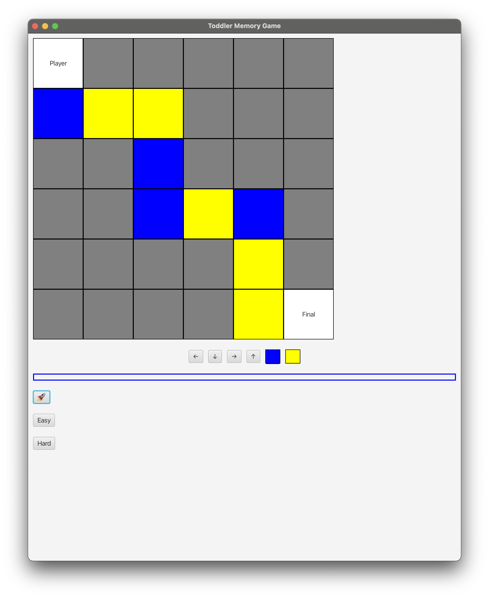
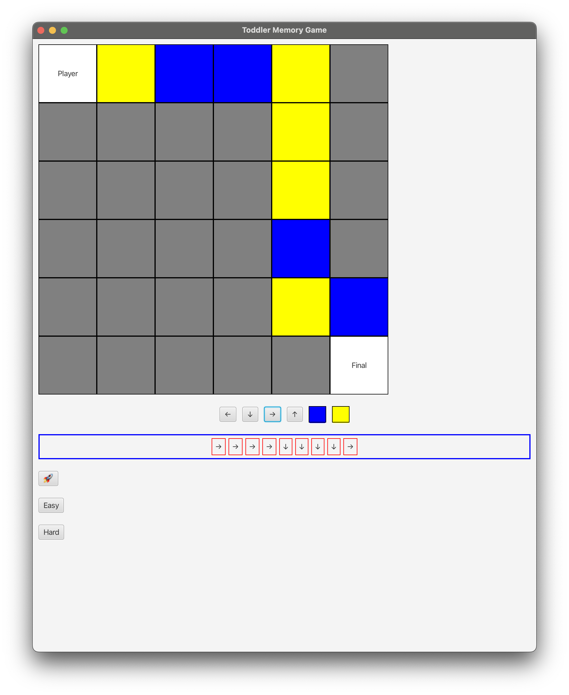
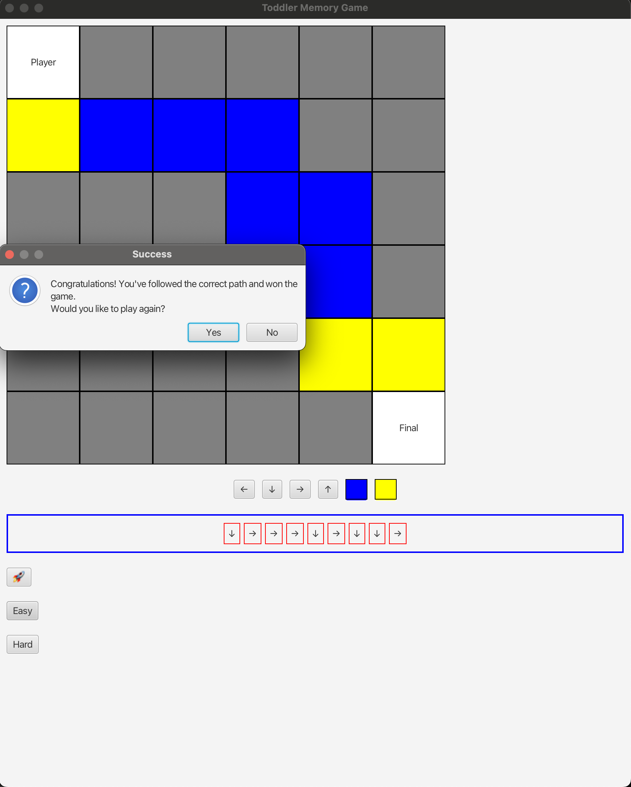
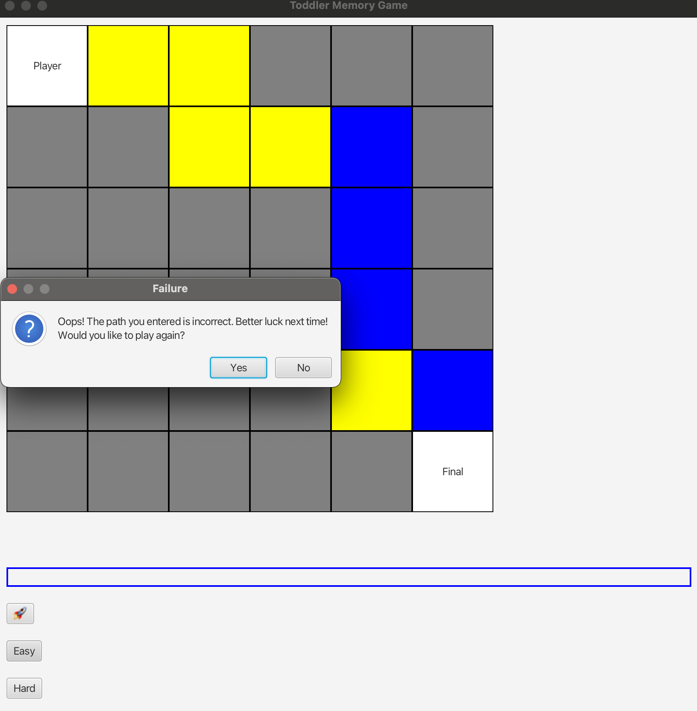

# Toddler

# Prerequesite

- Use Java SDK 17 due to UI compatible with JavaFX
- Install maven

# Run

```
mvn clean install
mvn clean javafx:run
```

# Get Started

The application leverages JavaFX as the UI framework to develop the toddler game.

## Start Game

The game will create an auto-generated random route for you.


- Click the "🚀" button to start the game
- 

## Play Game

- Players need to follow the route until they get to the `Final`
- The game offers you two kinds of level: Easy and Hard

### Easy mode

- Players only need to follow the route by clicking the below direction buttons
  - 

- After this step, you can click **"Easy"** button to see if inputs are 100% match with the game route
  - If you pass the test, the success message is dispalyed
    - 

### Hard mode

- Players must click the direction and color buttons for each step
  - 
- After you finish, click the "Hard" button to see if you pass the test

## Restart or Finish

Players can decide to play again or exit every time the game is finished.



# Code Insights

## Folder structures

### mode
- This folder is dedicated to organize the game mode
- Each game mode has its own implementation by implementing the `Mode` interface
### path

- Responsible for managing the object structure of `Path` by favoring composition over inheritance
- `Path` has `Step`s and each `Step` has a `Direction`, `Color` and `Location`

### state

- Decouple the logic from the UI components provided by JavaFX

### view
- Controlling all the UI widgets
- To do so, we harness the power of the **Observer pattern**
- That is, whenever a UI component state is changed, other components interested in the state changes are notified and thus reflect on it
### util
- Helper classes that may not directly correlated to the game itself